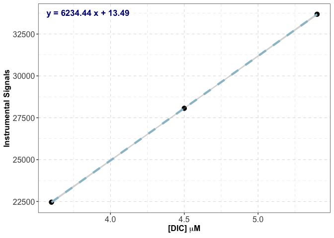

LI-5350A_DIC_Analysis
================
Tianyin Ouyang
2026-02-20

This R script is written to analyze CSV data files generated by the DIC
C5-12T v4.5 software using the Apollo SciTech LI-5350A DIC analyzer
(LI-COR Environmental, USA). The code is specifically intended for files
uploaded to Google Drive, but it can also be used with locally saved
files.

If you have any questions or concerns regarding to the code, please do
not hesitate to reach out to Tia Ouyang (<touyang@umces.edu>).

\##Install and Load All Required Packages

``` r
if (!require("googledrive")) install.packages("googledrive")
```

    ## Loading required package: googledrive

``` r
if (!require("tidyverse")) install.packages("tidyverse")
```

    ## Loading required package: tidyverse

    ## ── Attaching core tidyverse packages ──────────────────────── tidyverse 2.0.0 ──
    ## ✔ dplyr     1.2.0     ✔ readr     2.1.6
    ## ✔ forcats   1.0.1     ✔ stringr   1.6.0
    ## ✔ ggplot2   4.0.2     ✔ tibble    3.3.1
    ## ✔ lubridate 1.9.5     ✔ tidyr     1.3.2
    ## ✔ purrr     1.2.1     
    ## ── Conflicts ────────────────────────────────────────── tidyverse_conflicts() ──
    ## ✖ dplyr::filter() masks stats::filter()
    ## ✖ dplyr::lag()    masks stats::lag()
    ## ℹ Use the conflicted package (<http://conflicted.r-lib.org/>) to force all conflicts to become errors

``` r
if (!require("ggplot2")) install.packages("ggplot2")
if (!require("writexl")) install.packages("writexl")
```

    ## Loading required package: writexl

``` r
if (!require("readr")) install.packages("readr")

library(googledrive)
library(tidyverse)
library(ggplot2)
library(writexl)
library(readr)
```

\##Read data files from Google Drive A publicly accessible link to the
data file must be obtained from Google Drive by clicking “Get link” and
changing the access setting to “Anyone with the link can view.” Identify
the file ID from the link. The file ID is the long string located
between /d/ and /view. Replace the example code with your own file ID.

For example:
<https://drive.google.com/file/d/1wINgFaJyzGOTKv5hurTC9eaPycqkR_TZ/view?usp=share_link>
The file ID: “1wINgFaJyzGOTKv5hurTC9eaPycqkR_TZ”

``` r
file_id <- "1wINgFaJyzGOTKv5hurTC9eaPycqkR_TZ" ##replace with your own file ID

url <- paste0("https://drive.google.com/uc?export=download&id=", file_id)
data <- read_delim(url, delim = ";",  show_col_types = FALSE)
```

    ## New names:
    ## • `` -> `...18`

``` r
view(data)
```

\##Clean and reorganize the data table This step removes unnecessary
columns and rows for the purpose of calculating \[DIC\].

``` r
data <- data.frame(data[,c(3,5,14,17)])
data <- subset(data, data$Status != "Excluded")
view(data)
```

\##Construct the calibration curve

``` r
std_conc <- 3000 ##replace with [DIC] (uM) in your standards

##calculate means of each calibration curve points
Cal <- aggregate(`Area..net.`~`Sample.Name` + `Volume..ml.`, data = data[1:9,], FUN = mean)

##linear regression fit of the calibration curve
fit <- lm(Cal$Area..net.~ I(std_conc*(Cal$Volume..ml./1000)))
##check information of the linear regression fit
summary(fit)
```

    ## 
    ## Call:
    ## lm(formula = Cal$Area..net. ~ I(std_conc * (Cal$Volume..ml./1000)))
    ## 
    ## Residuals:
    ##      1      2      3 
    ##  2.386 -4.773  2.386 
    ## 
    ## Coefficients:
    ##                                      Estimate Std. Error  t value Pr(>|t|)    
    ## (Intercept)                            13.485     20.941    0.644 0.635786    
    ## I(std_conc * (Cal$Volume..ml./1000)) 6234.444      4.593 1357.433 0.000469 ***
    ## ---
    ## Signif. codes:  0 '***' 0.001 '**' 0.01 '*' 0.05 '.' 0.1 ' ' 1
    ## 
    ## Residual standard error: 5.846 on 1 degrees of freedom
    ## Multiple R-squared:      1,  Adjusted R-squared:      1 
    ## F-statistic: 1.843e+06 on 1 and 1 DF,  p-value: 0.000469

``` r
##plot the calibration curve 
eq <- paste0("y = ",round(coef(fit)[2],2), " x + ",round(coef(fit)[1],2))

ggplot(Cal,aes(x = std_conc*(Volume..ml./1000), y = Area..net.)) + geom_point(size = 3) + geom_smooth(method = "lm", linetype = "dashed", linewidth = 1.5, color = "lightblue3") + theme_bw() + theme(panel.grid = element_line(color = "gray", linewidth = 0.2, linetype = "dashed"), axis.title = element_text(size = 12, face = "bold"), axis.text = element_text(size = 12)) + ylab("Instrumental Signals") + xlab(expression(bold("[DIC] "*mu*"M"))) + annotate(geom = "text", label = eq, x = -Inf, y = Inf, hjust = -0.1, vjust = 2,fontface = "bold",size = 4.5, color = "navy")
```

    ## `geom_smooth()` using formula = 'y ~ x'

<!-- -->

\##Determination of \[DIC\] in samples using the calibration curve

``` r
##compute [DIC] using the calibration curve
data$DIC <- (data$Area..net.-coef(fit)[1])/coef(fit)[2]/(data$Volume..ml./1000)

##evaluate the mean, max, and min for each sample 
data_analyze <- data.frame(aggregate(DIC ~ `Sample.Name`, data = data[-(1:9), ], FUN = function(x) c(mean = mean(x), max  = max(x), min  = min(x))))
data_analyze <- data.frame(samples = data_analyze$`Sample.Name`, DIC_mean = data_analyze$DIC[, "mean"], DIC_max  = data_analyze$DIC[, "max"], DIC_min  = data_analyze$DIC[, "min"])
```

\##Export analyzed data

``` r
##save the file locally
##Note that you should replace the path with your own local file path, and the name with whatever you want to name your data file
path <- "Local_File_Path"
name <- "Your_File_Name.xlsx"

path_xlsx <- paste0(path, "/", name)
write_xlsx(data_analyze, path = path_xlsx)

##upload analyzed data to Google Drive
drive_auth() ##Grants R permission to access Google Drive
##A publicly accessible link for the folder where you want to store data must be obtained from Google Drive by clicking “Get link” and setting the access to “Anyone with the link can edit.” Next, identify the folder ID from the link. The folder ID is the long string located between "/folders/" and "?". Replace the example code with your own folder ID.
folder <- "Example_Folder_ID"
drive_upload(media = path_xlsx, path = as_id(folder), name = name)
```
