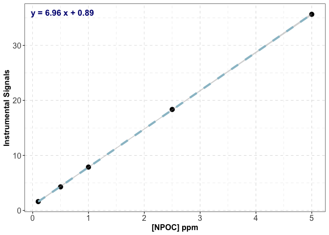
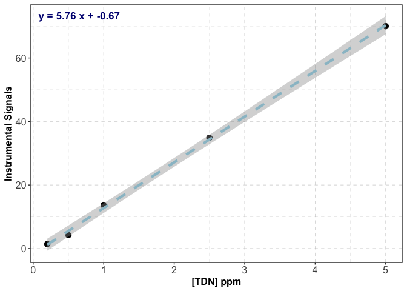

Shimadzu_TOC_Analysis
================
Tianyin Ouyang
2026-04-27

## Introduction

This code is created to determine \[NPOC\] and \[TDN\] in water samples
analyzed via Shimadzu TOC-L and TNM-L analyzer

## Install and load required packages

``` r
if (!require("readr")) install.packages("readr")
```

    ## Loading required package: readr

``` r
if (!require("ggplot2")) install.packages("ggplot2")
```

    ## Loading required package: ggplot2

``` r
if (!require("writexl")) install.packages("writexl")
```

    ## Loading required package: writexl

``` r
library(readr)
library(ggplot2)
library(writexl)
source("https://raw.githubusercontent.com/touyang98/General-Data-Analysis-Codes/main/Shimadzu_TOC/Shimadzu_TOC_Functions.R")
```

## Read Shimadzu Data

Export Shimadzu data to txt including all details

``` r
data <- read_delim("TOC_Test_Data.txt", delim = "\t", skip = 10)

##remove the excluded data
data <- subset(data , data$Excluded == 0)

##optional: remove unwanted or failed data 
data <- data[c(43:69,85:249),]

##categorize the data into NPOC and TDN 
data_NPOC <- subset(data, data$`Analysis(Inj.)` == "NPOC")
data_TDN <- subset(data, data$`Analysis(Inj.)` == "TN")
```

## Construct the calibration curve

The extract_cal function is written to extract calibration curve
standards from the raw data and to calculate the mean for each
calibration points. The plot_cal function is used to plot the
calibration curve with linear fitted calibration curve equation shown.

``` r
##NPOC calibration curve 
std_conc_NPOC <- c(5, 2.5, 1, 0.5, 0.1)
data_NPOC_cal <- extract_cal(data = data_NPOC, std_conc = std_conc_NPOC)
fit_NPOC <- lm(data_NPOC_cal$Area ~ data_NPOC_cal$std_conc)
plot_cal(data = data_NPOC_cal, fit = fit_NPOC) + xlab("[NPOC] ppm")
```

    ## `geom_smooth()` using formula = 'y ~ x'

<!-- -->

``` r
##TDN calibration curve 
std_conc_TDN <- c(5, 2.5, 1, 0.5, 0.2)
data_TDN_cal <- extract_cal(data = data_TDN, std_conc = std_conc_TDN)
fit_TDN <- lm(data_TDN_cal$Area ~ data_TDN_cal$std_conc)
##optional: what if my standard injection volume is not matching sample injection volume
##for example: standard injection V is 40 uL, whereas the sample injection V is 100 uL. 
data_TDN_cal$Area <- data_TDN_cal$Area/(40/100)
plot_cal(data = data_TDN_cal, fit = fit_TDN)+ xlab("[TDN] ppm")
```

    ## `geom_smooth()` using formula = 'y ~ x'

<!-- -->
\## Determine the \[NPOC\] and \[TDN\] in water samples using the
developed calibration curves

``` r
##determine the [NPOC] 
data_NPOC_analyzed <- determ_conc(data = data_NPOC, fit = fit_NPOC)

##determine the [TDN]
data_TDN_analyzed <- determ_conc(data = data_TDN, fit = fit_TDN)
```

## Optional: Multiply with dilution factors if needed

``` r
##NPOC dilution factor corrections
data_NPOC_analyzed$dilution_factor <- c(6,6,1,6,6,1,6,6,1,6,6,6,6)
data_NPOC_analyzed$conc_corr <- data_NPOC_analyzed$conc_mean * data_NPOC_analyzed$dilution_factor

##TDN dilution factor corrections
data_TDN_analyzed$dilution_factor <- c(6,6,1,6,6,1,6,6,1,6,6,6,6)
data_TDN_analyzed$conc_corr <- data_TDN_analyzed$conc_mean * data_TDN_analyzed$dilution_factor
```

## Export analyzed data

``` r
##save the file locally
##Note that you should replace the path with your own local file path, and the name with whatever you want to name your data file
path <- "Local_File_Path"
name <- "Your_File_Name.xlsx"

path_xlsx <- paste0(path, "/", name)
write_xlsx(data_NPOC_analyzed, path = path_xlsx)
```
